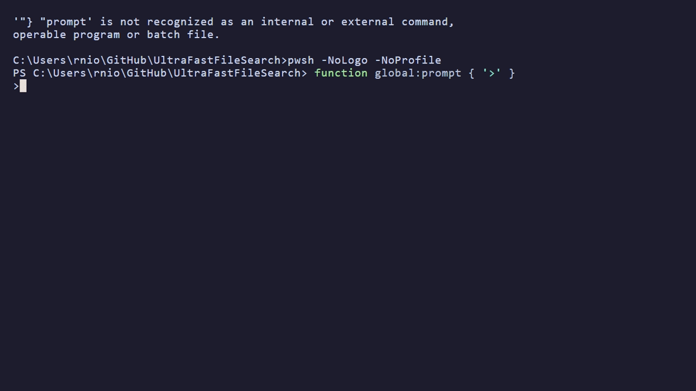
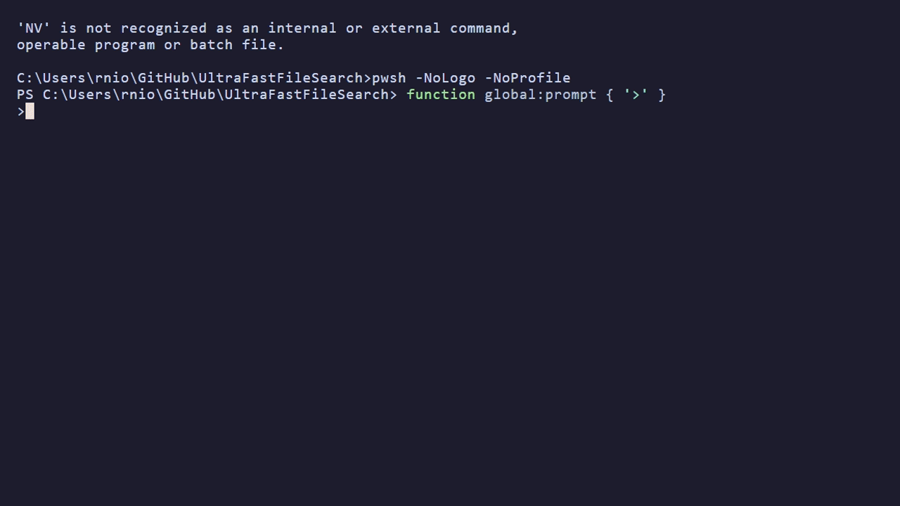

<p align="center">
  
</p>

<p align="center">
  <b>Wire-speed search across your NTFS drives. No indexing. No waiting.</b><br>
  <sub>A Rust-native engine by <a href="https://github.com/skyllc-ai">Sky, LLC</a> — open source, MPL-2.0.</sub>
</p>

<p align="center">
  <a href="https://github.com/skyllc-ai/UltraFastFileSearch/actions/workflows/pr-fast.yml"></a>
  <a href="https://github.com/skyllc-ai/UltraFastFileSearch/releases/latest"></a>
  <a href="https://github.com/skyllc-ai/UltraFastFileSearch/releases/latest"></a>
  <a href="LICENSE"></a>
  <a href="https://github.com/skyllc-ai/UltraFastFileSearch/releases/latest"></a>
  <a href="https://opencollective.com/uffs-search"></a>
  <a href="https://ko-fi.com/ufffssearch"></a>
</p>

**A benchmark-driven NTFS search engine for Windows.** UFFS reads the Master File Table directly, builds a compact persisted index, and keeps large NTFS estates searchable through a background daemon.

> Proven on a real 7-drive, 25.9M-record Windows system; scale-ceiling tested to **100.4M records** with offline MFT clones (v0.5.4 baseline; v0.5.120 current):
> - **68.5 s COLD** — raw MFT read + compact index build (v0.5.71, flat ± 4 % vs v0.5.4)
> - **5.7 s WARM CACHE** — restart from serialized cache (v0.5.62/v0.5.71, **−17 %** vs v0.5.4)
> - **0–3 ms daemon-side** for targeted queries — exact/prefix/ext/substring, unchanged from v0.5.4
> - **17–39 ms CLI end-to-end** for targeted single-drive queries on v0.5.120 (Windows process spawn + query; v0.5.71 measured 29–32 ms)
> - **vs Everything on v0.5.120**: UFFS wins **30/30 head-to-head cells** at p50 across four drives + the combined index, median ratio **0.36× (~2.8× faster)** — see the [**benchmark hub**](docs/benchmarks/) and the [full v0.5.120 report](docs/benchmarks/2026-06-v0.5.120-vs-everything.md)

UFFS is built for **exact filename, path, and metadata search** at scales where directory walking, shell search, and some automation surfaces become the bottleneck. It is open source, written in Rust, and designed first for deterministic local search; CLI, TUI, API, and MCP are all interfaces on top of the same engine.

> An open-source NTFS search engine for Windows power users, developers, IT teams, and investigations-style workflows.

📖 **[Full User Manual](docs/user-manual/index.md)** — installation, tutorials, filters, daemon, TUI, MCP integration, and more.

> **Open source, forever.** The UFFS platform — engine, daemon, CLI, and MCP server — is licensed under the [Mozilla Public License 2.0](LICENSE). Code released as part of UFFS Core will never be made less open. Commercial products and enterprise offerings are built on top of the open platform, not by restricting it.

---

## Why UFFS?

- ⚡ **100M-record proven scale** — measured from 25.9M across 7 drives up to 100.4M across 16 drives
- 🚀 **Cold / warm / hot architecture** — build once from raw MFT, restart fast from cache, answer hot queries from memory
- 🔍 **40+ filters** — size, date, extension, type, attributes, path length, tree size, regex
- 🧩 **One engine, multiple interfaces** — CLI, TUI, daemon, API, and MCP share the same index
- 🧭 **Deterministic local scope** — built for exact NTFS filename/path/metadata search, not fuzzy ranking
- 🔒 **No telemetry, fully local** — UFFS makes no outbound network calls; your index and queries never leave your machine (the optional MCP gateway binds a local-only port you explicitly enable)
- 🖥️ **Cross-platform offline analysis** — live NTFS on Windows; offline MFT analysis on macOS and Linux

---

## See it in action

Every clip runs the **real binary** against real NTFS data with unedited timings and result counts — captured with the reproducible [demo kit](scripts/dev/demo/README.md).

<p align="center">
  <br>
  <sub><b>TUI</b> — unzip, run <code>uffs-tui</code>, and browse your own drives in seconds. <a href="assets/demo/uffs-tui.gif">Full reel</a>.</sub>
</p>

<p align="center">
  <br>
  <sub><b>CLI</b> — real commands, real result counts, real measured latency on a hot daemon. <a href="assets/demo/uffs-cli.gif">Full 9-step reel</a>.</sub>
</p>

<p align="center">
  <br>
  <sub><b>MCP</b> — one question to Claude, one UFFS tool call: 26M+ records scanned in under 200 ms (hot daemon), and the reply cites the measured query time. Deterministic search underneath, MCP on top.</sub>
</p>

---

## Benchmark snapshot (v0.5.120 · June 2026)

Measured 2026-06-11 on AMD Ryzen 9 3900XT, 64 GB RAM, Windows 11 Pro 24H2 — cross-tool on four NTFS volumes (C/D/F/G, 12.8 M records, the Everything-RAM-budget-negotiated set), full-scan on all seven (25.9 M records; that workload is UFFS-only, so the negotiation doesn't constrain it). Raw data: [`cross-tool-summary.csv`](docs/benchmarks/raw/2026-06-v0.5.120_cross-tool-summary.csv) · [`full-scan-all-drives.csv`](docs/benchmarks/raw/2026-06-v0.5.120_full-scan-all-drives.csv). Publication-grade report: [**docs/benchmarks/**](docs/benchmarks/).

**vs the competition** (10 rounds per cell, p50, file sink):

- **30/30 head-to-head cells faster than Everything** — median ratio **0.36× (~2.8× faster)** across C/D/F/G + the combined index; every cell from the April snapshot improved (median −33%)
- **Full-scan export across all 7 drives: 23.3 M rows → CSV in 12.0 s ≈ 1.95 M rec/s** (+13% throughput vs April at the same scale) — a workload Everything's CLI export cannot run (~2 GB IPC ceiling)
- **180×–3 400× vs the UFFS C++ reference** on targeted queries (daemon HOT vs per-invocation MFT re-read); 6.6× on combined full-scan

**Latency shape** (v0.5.120):

- **0–3 ms daemon-side** for targeted queries (exact, prefix, ext, substring, combined) — unchanged since v0.5.4
- **17–39 ms CLI end-to-end** single-drive (the Windows process-spawn floor + query); 21–108 ms across the combined four-drive index

**Phase costs** — from earlier captures, version-tagged, not re-measured on v0.5.120:

| Phase | What happens | ALL 7 drives (v0.5.71) | Single NVMe (v0.5.4) |
|-------|--------------|-----------------------:|---------------------:|
| **COLD** | Raw MFT read, parse, compact index build, cache write | 68.5 s | 7.7 s |
| **WARM CACHE** | Daemon restart + serialized cache load | **5.7 s** | 6.4 s |
| **HOT (`*` top-100)** | Full-scan across all drives with `--limit 100` | **1 112 ms** e2e¹ | 27 ms |
| **HOT (targeted)** | `notepad.exe` / `win*` / `*.dll` / `config` etc. | **29–32 ms** CLI e2e | 9–10 ms |

¹ The `*` top-100 path regressed from the v0.5.4 163 ms figure after the Phase 2 sort rewrite ([raw log](docs/benchmarks/raw/2026-04-v0.5.66_full-benchmark-suite.txt), n=30, StdDev 21 ms); daemon-side is 1 081 ms — the CLI tax is negligible here. Tracked in the [archived April report](docs/benchmarks/archive/2026-04-v0.5.66-vs-everything-and-cpp.md#known-regressions).

**Scale ceiling:** **100.4 M records** tested with offline MFT clones (v0.5.4 capture, not re-verified since) — targeted queries stayed at 11–13 ms e2e.

> 📖 **[Benchmark hub](docs/benchmarks/)** — dated competitive-benchmark reports, fairness methodology, archive of prior versions, reproduction scripts.
> 📖 **[Full benchmark data](docs/user-manual/performance.md)** — methodology, per-drive tables, interactive search percentiles, bulk retrieval, scale ceiling, and caveats.

---

## Download & Install

> **[⬇ Latest Release — GitHub Releases tab](https://github.com/skyllc-ai/UltraFastFileSearch/releases/latest)**

Each release ships pre-built binaries, a `CHECKSUMS.txt` (SHA256), per-crate SBOMs (CycloneDX), and SLSA build-provenance attestations — no build toolchain needed.

| Platform | Download | Notes |
|---|---|---|
| **Windows x64** | [`uffs-windows-x64.zip`](https://github.com/skyllc-ai/UltraFastFileSearch/releases/latest) | CLI + daemon + MCP + MFT tools + `uffs-tui` demo. Recommended. |
| **macOS Apple Silicon** | [`uffs-macos-arm64.zip`](https://github.com/skyllc-ai/UltraFastFileSearch/releases/latest) | Offline MFT analysis only. Includes `UFFS.app` bundle + `uffs-tui` demo. |
| **Linux x64** | [`uffs-linux-x64.zip`](https://github.com/skyllc-ai/UltraFastFileSearch/releases/latest) | Offline MFT analysis only. Includes `install.sh` + `uffs-tui` demo. |

> 📦 **Three tiers per platform** — `…-min.zip` (just `uffs` + `uffsd` + the `uffs-tui` demo, for CI/scripting), the bare `….zip` (**recommended**: adds MCP + MFT tooling + docs), and `…-full.zip` (adds the `uffs-diag` diagnostic tools). Every tier bundles the free `uffs-tui` demo.

> 🖥️ **Fastest way to try it — no CLI required.** Unzip any tier and run **`uffs-tui`**: the daemon auto-starts and you're browsing your own drives in a UI within seconds. The bundled TUI is the free demo (capped result counts, exports disabled — see `DEMO-LICENSE.txt`); full TUI/GUI are commercial.

**Windows quick-install (one command) — via [WinGet](https://learn.microsoft.com/windows/package-manager/):**
```powershell
winget install SkyLLC.UFFS
```

Or grab the ZIP above, extract it anywhere, add the folder to PATH, then:
```powershell
uffs --version
```

**Verify the download:**
```bash
# SHA256 checksum
sha256sum -c CHECKSUMS.txt

# SLSA build-provenance attestation (proves the binary came from this exact workflow run)
gh attestation verify uffs-windows-x64.exe --owner skyllc-ai
```

**Build from source** (contributors / nightly development only):
```bash
# Requires Rust nightly — channel is pinned in rust-toolchain.toml
cargo build --release
```

> 📖 **[Full installation guide](docs/user-manual/installation.md)** — WinGet, PATH setup, daemon autostart, Scoop (coming)

> 🖥️ **Prefer a UI?** The free **`uffs-tui` demo is bundled in every release ZIP** above — just run `uffs-tui`. Standalone demo builds of the TUI **and GUI** (macOS, Linux, Windows) also live at **[uffs-demo/releases](https://github.com/githubrobbi/uffs-demo/releases/latest)** — limited result counts, exports disabled. They drive this same open-source daemon. Full versions are commercial (see [Maintainership & Commercial](#maintainership--commercial)).

---

## Quick Start

```bash
# Search all drives (daemon starts automatically on first query)
uffs "*.rs"

# Search a specific drive
uffs "*.txt" --drive C

# Filter by size, date, type
uffs "*.log" --min-size 100MB --newer 7d --files-only

# macOS/Linux: search offline MFT captures
uffs "*.txt" --data-dir ~/uffs_data

# Daemon management
uffs daemon status
uffs daemon restart

# Memory tiering — operator-driven controls (Phase 8)
uffs daemon status_drives                 # per-drive tier + telemetry table
uffs daemon hibernate                     # demote every drive to Cold (free RAM)
uffs daemon preload C --pin-minutes 60    # pin a hot drive in RAM
uffs daemon forget C --force              # evict + delete on-disk caches
```

> 📖 **[Installation](docs/user-manual/installation.md)** · **[5-minute tutorial](docs/user-manual/getting-started.md)** · **[CLI reference](docs/user-manual/cli-overview.md)** · **[40+ filters](docs/user-manual/filters.md)**

### Memory tiering at a glance

The daemon keeps each drive's compact index in one of four tiers, demoted automatically by an idle TTL ladder + memory-pressure cascade and promoted on first search:

| Tier | RAM cost | Source-of-truth | When |
|---|---|---|---|
| **Hot** | full body + bloom + trie | live in RAM | actively pinned (post-`preload`) or recently queried |
| **Warm** | full body + bloom + trie | live in RAM | default after load; ready for any search |
| **Parked** | bloom + trie only | live in RAM | idle past warm TTL; can answer "definitely not on this drive" without re-promote |
| **Cold** | (nothing in RAM) | encrypted compact cache on disk | idle past parked TTL or operator-hibernated; re-promote on next search |

Operator commands let you tune this manually for known workload shapes — `preload` pins a search-heavy drive against demote, `hibernate` frees RAM during long idle stretches, `forget` permanently evicts a drive plus its on-disk caches, and `status_drives` surfaces the live tier + pin + query-rate snapshot.

> 📖 **[Memory-tiering Windows-host runbook](docs/architecture/memory-tiering-windows-host-validation.md)** — what to run on a multi-drive Windows box to validate the operator surface.

---

## How It Works

1. **Read** — Opens the raw NTFS volume and reads the MFT sequentially using IOCP with a sliding window. Bitmap skip eliminates 40–55% of I/O by skipping deleted records.
2. **Parse** — Each I/O buffer is parsed inline into a compact 224-byte `FileRecord` — zero intermediate copies, zero per-record heap allocations. On NVMe, Rayon parallelizes parsing across all CPU cores.
3. **Index** — Records are stored in a compact in-memory index with extension and trigram accelerators for fast targeted queries. DataFrame/export paths are built on top of the same core engine.
4. **Serve** — A background daemon holds the index in memory and answers queries via IPC. CLI, TUI, and MCP clients all share the same daemon.

> 📖 **[Architecture deep-dive](docs/architecture/engine/01-overview.md)** — 11 documents covering every subsystem.

---

## Architecture

| Crate | Role |
|-------|------|
| `uffs-mft` | Direct MFT reading → compact in-memory index ([📖](crates/uffs-mft/README.md)) |
| `uffs-core` | Query engine (Polars lazy API) |
| `uffs-daemon` | Background index server ([📖](docs/user-manual/daemon.md)) |
| `uffs-cli` | Command-line interface ([📖](docs/user-manual/cli-overview.md)) |
| `uffs-mcp` | MCP server for AI agents ([📖](docs/user-manual/mcp.md)) |
| `uffs-polars` | Polars compilation-isolation facade |
| `uffs-client` | IPC client library |

---

## Alternatives & Landscape

UFFS was built after the author wrote [an earlier C++ MFT search tool](https://github.com/githubrobbi/Ultra-Fast-File-Search) and then rebuilt it from scratch in Rust for safety, performance, and maintainability.

### Comparison scope

UFFS competes first in the **local NTFS filename/path/metadata** lane: exact search across large Windows filesystems with deterministic scope and a reusable in-memory daemon.

We do **not** collapse all search products into one "fastest search tool" claim. The following are different benchmark classes and should be compared separately:

1. **Readiness** — cold build, warm restart, and hot query
2. **Interactive search** — end-to-end top-N query latency
3. **Bulk retrieval** — time to stream or export large result sets
4. **Scale ceiling** — largest corpus completed without timeout, crash, or incorrect results

That distinction matters because a tool can be excellent at interactive top-N search and still hit a wall during full-result export or very large automation workloads.

The older C++ implementation remains useful as a parity and regression baseline, but it is **not** the headline market benchmark for the Rust engine. Public cross-tool comparisons should be run against the current Rust engine with exact versions, settings, workloads, and raw results published alongside the charts.

### How UFFS compares to other file search tools

| Category | Tools | How UFFS differs |
|----------|-------|-----------------|
| **Instant NTFS filename search** | [Everything (voidtools)](https://www.voidtools.com/), [WizFile](https://antibody-software.com/wizfile/), [WizTree](https://www.diskanalyzer.com/), [UltraSearch (JAM Software)](https://www.jam-software.com/ultrasearch), [SwiftSearch](https://sourceforge.net/projects/swiftsearch/), [Locate32](https://locate32.cogit.net/) | Open-source Rust engine; 100M-record proven scale; compact index + daemon + CLI + TUI + MCP; 40+ filters; forensic mode; cross-platform offline analysis |
| **Content / regex search** | [FileLocator Pro / Agent Ransack](https://www.mythicsoft.com/filelocatorpro/), [grepWin](https://tools.stefankueng.com/grepWin.html), [AstroGrep](http://astrogrep.sourceforge.net/), [dnGrep](https://dngrep.github.io/), [SearchMyFiles (NirSoft)](https://www.nirsoft.net/utils/search_my_files.html) | UFFS focuses on MFT-level metadata speed; pairs well with `ripgrep` for content |
| **Enterprise / eDiscovery** | [X1 Search](https://www.x1.com/), [dtSearch](https://www.dtsearch.com/), [Copernic](https://copernic.com/) | UFFS is a specialist local-NTFS tool, not a multi-repository governance platform |
| **Developer CLI** | [fd](https://github.com/sharkdp/fd), [ripgrep](https://github.com/BurntSushi/ripgrep), [fzf](https://github.com/junegunn/fzf), [GNU find](https://www.gnu.org/software/findutils/) | UFFS reads the MFT instead of walking directories — orders of magnitude faster for whole-drive search |
| **Forensic MFT tools** | [MFTECmd (Eric Zimmerman)](https://ericzimmerman.github.io/), [analyzeMFT](https://github.com/dkovar/analyzeMFT) | UFFS is an interactive search engine, not a one-shot parser; includes daemon, TUI, and live queries |
| **Linux / macOS** | [FSearch](https://github.com/cboxdoerfer/fsearch), [Recoll](https://www.recoll.org/), [DocFetcher](https://docfetcher.sourceforge.net/), [Catfish](https://docs.xfce.org/apps/catfish/start), [Find Any File](https://findanyfile.app/), [HoudahSpot](https://www.houdah.com/houdahSpot/) | UFFS supports offline MFT analysis on macOS/Linux via cached index files |

> 📖 **[Full competitor landscape analysis](docs/mft_competitor_landscape_deep_research.md)** — 12 tools, corporate adoption data, market positioning.

---

## Requirements

- **Windows** for live NTFS MFT reading (Administrator privileges required)
- **macOS / Linux** for offline MFT analysis (no admin needed)
- **Rust nightly** (Edition 2024) to build from source — channel pinned in `rust-toolchain.toml`; the workspace has no stable MSRV (see CONTRIBUTING.md → "Toolchain policy")

---

## Documentation

| Topic | Link |
|-------|------|
| Installation | [docs/user-manual/installation.md](docs/user-manual/installation.md) |
| Getting started (5 min) | [docs/user-manual/getting-started.md](docs/user-manual/getting-started.md) |
| CLI overview & examples | [docs/user-manual/cli-overview.md](docs/user-manual/cli-overview.md) |
| 40+ search filters | [docs/user-manual/filters.md](docs/user-manual/filters.md) |
| Daemon management | [docs/user-manual/daemon.md](docs/user-manual/daemon.md) |
| TUI interactive search | [docs/user-manual/tui-search-box.md](docs/user-manual/tui-search-box.md) |
| MCP server (AI agents) | [docs/user-manual/mcp.md](docs/user-manual/mcp.md) |
| Performance & benchmarks | [docs/user-manual/performance.md](docs/user-manual/performance.md) |
| Cache & data sources | [docs/user-manual/cache-and-data.md](docs/user-manual/cache-and-data.md) |
| Architecture (11 docs) | [docs/architecture/engine/](docs/architecture/engine/) |
| FAQ | [docs/user-manual/faq.md](docs/user-manual/faq.md) |
| Troubleshooting | [docs/user-manual/troubleshooting.md](docs/user-manual/troubleshooting.md) |

---

## Contributing

Start with [CONTRIBUTING.md](CONTRIBUTING.md) for the pinned toolchain, `just`/`cargo` workflows, and Windows/Admin caveats. For the broader docs map, see [docs/README.md](docs/README.md) and [docs/dev/README.md](docs/dev/README.md).

---

## License & Trademarks

**Code.** UFFS is licensed under the [Mozilla Public License 2.0 (MPL-2.0)](LICENSE).

You can use, modify, and distribute UFFS freely. If you modify MPL-covered source files and distribute the result, those file-level changes must remain under MPL-2.0. Building proprietary applications on top of UFFS does not require opening your application.

See [LICENSES/MPL-2.0.txt](LICENSES/MPL-2.0.txt) for the full license text and [Mozilla's MPL FAQ](https://www.mozilla.org/en-US/MPL/2.0/FAQ/) for plain-language guidance.

**Brand.** The UFFS name, the UltraFastFileSearch wordmark, and the UFFS logo are project trademarks owned by [Sky, LLC](https://github.com/skyllc-ai). Usage is governed by [TRADEMARK.md](TRADEMARK.md) — not the MPL. Linking, reviews, tutorials, and unmodified redistributions are fine without asking; forks, merchandise, and commercial use of the mark need permission first.

---

## Maintainership & Commercial

UFFS is developed and maintained by **[Sky, LLC](https://github.com/skyllc-ai)** — a systems-engineering shop focused on high-performance Rust tooling.

- **Commercial UFFS frontends** (polished GUI / premium TUI) are in development on top of this open-source engine. For waitlist or partnership inquiries: [`uffs@nios.net`](mailto:uffs@nios.net) or open a [discussion](https://github.com/skyllc-ai/UltraFastFileSearch/discussions) with the `commercial-interest` label.
- **Hiring / collaboration.** This repository is also the public engineering portfolio of its maintainer; see the [Sky, LLC org page](https://github.com/skyllc-ai) for the full pitch and contact details.
- **Sponsorship.** UFFS is free and MPL-2.0 forever; sponsorships fund Windows code-signing, benchmark hardware, and release engineering. **Companies** (invoice / receipt via Sky, LLC): [Open Collective](https://opencollective.com/uffs-search). **One-time tip:** [Ko-fi](https://ko-fi.com/ufffssearch). Individual recurring tiers via **GitHub Sponsors** are being enrolled — the repo "Sponsor" button already lists the live channels above.

## Acknowledgments

UFFS benefits from the broader NTFS tooling ecosystem, including [SwiftSearch](https://sourceforge.net/projects/swiftsearch/) by wfunction. Deep competitive landscape analysis in [docs/mft_competitor_landscape_deep_research.md](docs/mft_competitor_landscape_deep_research.md).

---

<p align="center">
  <sub>
    <b>Maintainer:</b> Robert Nio ·
    <b>Organization:</b> <a href="https://github.com/skyllc-ai">Sky, LLC</a> ·
    <b>Repo:</b> <a href="https://github.com/skyllc-ai/UltraFastFileSearch">skyllc-ai/UltraFastFileSearch</a>
  </sub>
</p>
