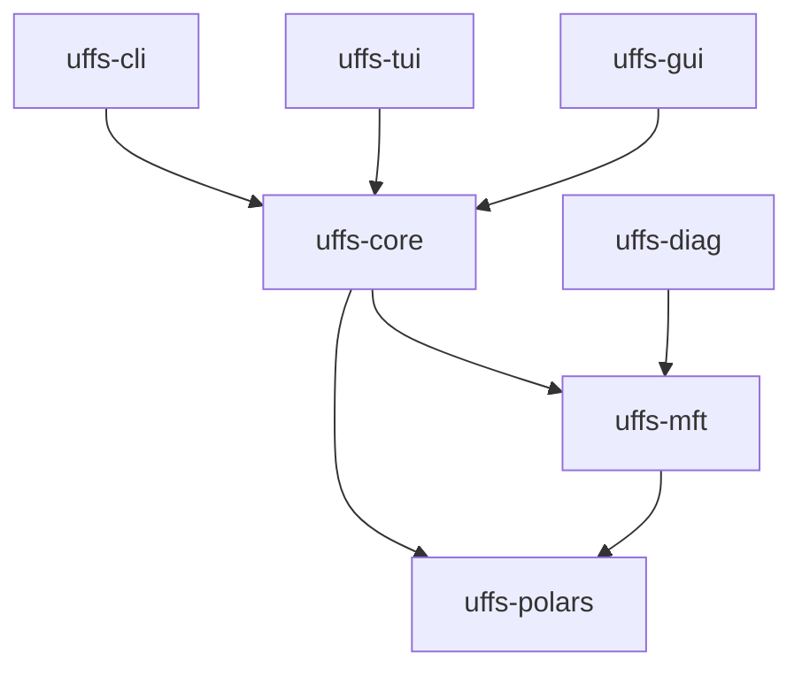
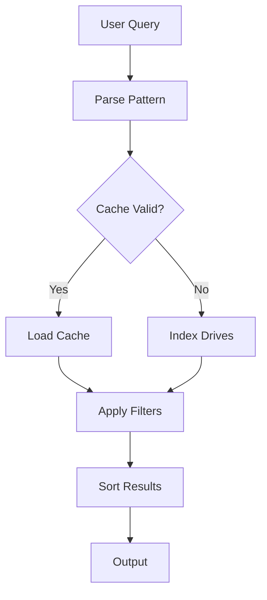

<!--
SPDX-License-Identifier: MPL-2.0
Copyright (c) 2025-2026 Robert Nio

UFFS - Ultra Fast File Search
-->

# 🌊 Wave 4: Documentation & API Excellence - Implementation Guide

> **Effort**: 2-3 days | **Priority**: 🟠 Major
> **Prerequisites**: Wave 3 complete
> **Reference**: [`uffs-modernization-plan-2026.md`](../uffs-modernization-plan-2026.md)

---

## ⚠️ Before You Start

1. **Create healing changelog**:
   ```bash
   touch LOG/$(date +%Y_%m_%d_%H_%M)_CHANGELOG_HEALING.md
   ```

2. **Verify Wave 3 complete**:
   ```bash
   just check && just clippy && just test
   ```

---

## 📋 Task Checklist

- [ ] 4.1 Rustdoc Coverage (100%)
- [ ] 4.2 CLI Documentation
- [ ] 4.3 MFT Field Documentation
- [ ] 4.4 Architecture Documentation

---

## 4.1 Rustdoc Coverage

### What You're Doing
Ensuring 100% documentation coverage for public APIs.

### Step-by-Step

**Step 1**: Check current coverage
```bash
RUSTDOCFLAGS="-Z unstable-options --show-coverage" cargo +nightly doc --workspace --no-deps
```

**Step 2**: Add missing documentation

Every public item needs:
```rust
/// Brief one-line description.
///
/// More detailed explanation if needed.
///
/// # Arguments
///
/// * `drive` - The drive letter to index (e.g., 'C')
///
/// # Returns
///
/// A DataFrame containing all files on the drive.
///
/// # Errors
///
/// Returns `UffsError::DriveNotFound` if the drive doesn't exist.
///
/// # Examples
///
/// ```rust
/// use uffs_mft::index_drive;
///
/// let df = index_drive('C')?;
/// println!("Found {} files", df.height());
/// ```
pub fn index_drive(drive: char) -> UffsResult<DataFrame> {
    // ...
}
```

**Step 3**: Enable doc warnings in Cargo.toml
```toml
[lints.rust]
missing_docs = "warn"
```

---

## 4.2 CLI Documentation

### What You're Doing
Complete CLI help text and man page generation.

### Step-by-Step

**Step 1**: Audit current --help output
```bash
cargo run -p uffs-cli -- --help
cargo run -p uffs-cli -- index --help
cargo run -p uffs-cli -- search --help
```

**Step 2**: Enhance clap documentation
```rust
#[derive(Parser)]
#[command(
    name = "uffs",
    about = "Ultra Fast File Search - Blazing fast NTFS file search",
    long_about = "UFFS reads the NTFS Master File Table (MFT) directly for \
                  instant file enumeration. Supports regex, wildcards, and \
                  advanced filtering.",
    version,
    author
)]
pub struct Cli {
    /// Search pattern (supports wildcards and regex)
    #[arg(help = "Pattern to search for (e.g., '*.rs', 'foo.*')")]
    pattern: Option<String>,

    /// Drives to search (default: all NTFS drives)
    #[arg(short, long, help = "Limit search to specific drives (e.g., -d C,D)")]
    drives: Option<String>,

    /// Use cached index (default: true)
    #[arg(long, help = "Skip cache and read MFT fresh")]
    no_cache: bool,
}
```

**Step 3**: Add man page generation
```bash
cargo add clap_mangen --dev -p uffs-cli
```

```rust
// build.rs
use clap::CommandFactory;
use clap_mangen::Man;

fn main() {
    let cmd = Cli::command();
    let man = Man::new(cmd);
    let mut buffer = Vec::new();
    man.render(&mut buffer).unwrap();
    std::fs::write("target/uffs.1", buffer).unwrap();
}
```

---

## 4.3 MFT Field Documentation

### What You're Doing
Documenting all MFT fields and their meanings.

### Create MFT Field Reference

Create `docs/mft-fields.md`:
```markdown
# MFT Field Reference

## Standard Fields

| Field | Type | Description |
|-------|------|-------------|
| `frs` | u64 | File Reference Segment number (unique per file) |
| `parent_frs` | u64 | Parent directory FRS |
| `name` | String | File or directory name |
| `path` | String | Full resolved path |
| `size` | u64 | File size in bytes |
| `created` | DateTime | Creation timestamp |
| `modified` | DateTime | Last modification timestamp |
| `accessed` | DateTime | Last access timestamp |
| `flags` | u32 | MFT record flags |

## Flags

| Flag | Value | Description |
|------|-------|-------------|
| `IN_USE` | 0x01 | Record is in use |
| `DIRECTORY` | 0x02 | Record is a directory |
| `EXTENSION` | 0x04 | Record is an extension record |
| `SPECIAL_INDEX` | 0x08 | Special index present |

## Attributes

| Type | Name | Description |
|------|------|-------------|
| 0x10 | $STANDARD_INFORMATION | Timestamps, flags |
| 0x30 | $FILE_NAME | File name, parent ref |
| 0x40 | $OBJECT_ID | Object identifier |
| 0x80 | $DATA | File data or data runs |
| 0x90 | $INDEX_ROOT | Directory index root |
| 0xA0 | $INDEX_ALLOCATION | Directory index allocation |
```

---

## 4.4 Architecture Documentation

### What You're Doing
Adding Mermaid diagrams for key architecture.

### Crate Dependency Graph


### MFT Reading Pipeline


### Query Execution Flow


---

## ✅ Wave 4 Completion Checklist

- [ ] 100% rustdoc coverage for public APIs
- [ ] All public items have examples
- [ ] CLI --help is comprehensive
- [ ] Man pages generated
- [ ] MFT field reference complete
- [ ] Architecture diagrams added

### Final Validation
```bash
RUSTDOCFLAGS="-Z unstable-options --show-coverage" cargo +nightly doc --workspace --no-deps
rust-script scripts/ci-pipeline.rs go -v
```

---

*Previous: [Wave 3 - Testing Excellence](wave-3-testing-excellence.md)*
*Next: [Wave 5 - Performance & Observability](wave-5-performance-observability.md)*

