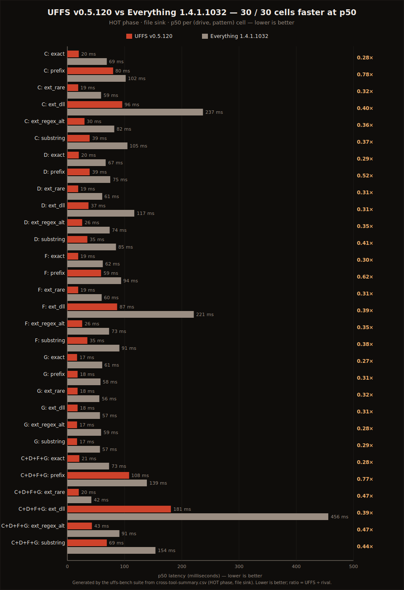
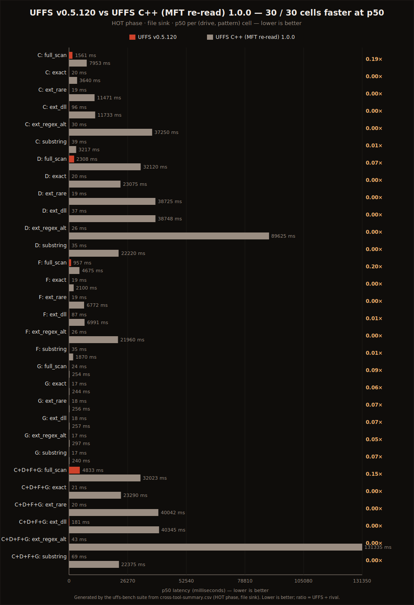
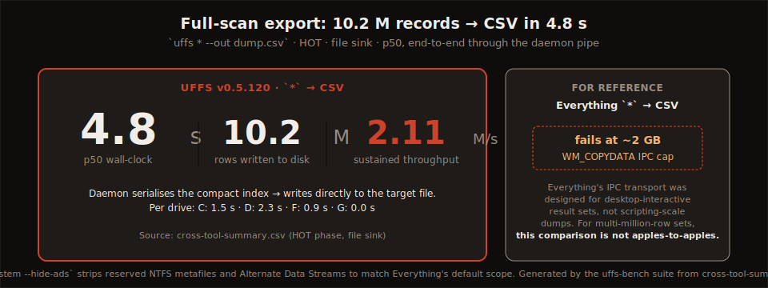
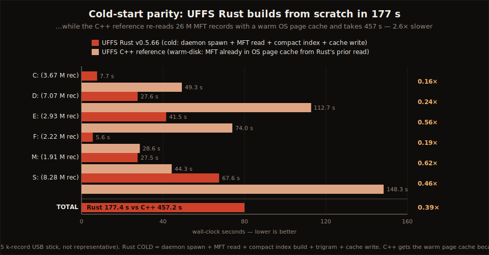
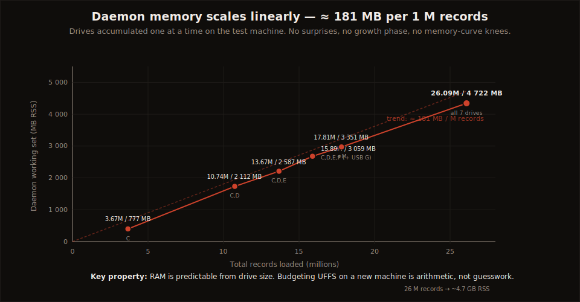

# UFFS v0.5.120 — Search Latency vs Everything and the UFFS C++ Reference (June 2026 snapshot)

**Against** Everything (voidtools) 1.4.1.1032 (engine, private `-instance` sandbox) driven via `es.exe` 1.1.0.30 · UFFS C++ reference 1.0.0 (legacy)
**Tested on** AMD Ryzen 9 3900XT · 64 GB DDR4-3600 · Windows 11 Pro 24H2 (build 26100)
**Scope** Cross-tool: C: + D: + F: + G: NTFS volumes · 12 815 626 live file records (C/F NVMe, D HDD, G removable 16 GB test volume). Full-scan export (UFFS-only workload): all 7 volumes · 25.9 M records
**Measured** 2026-06-11 · UFFS v0.5.120 · HOT phase, file sink, p50/p95 over 10 rounds per cell
**Reproduces** via `just bench-suite --drives C,D,F,G` (the [robust benchmark flow](robust-benchmark-flow-execution-plan.md)) / [`scripts/windows/cross-tool-benchmark.rs`](../../scripts/windows/cross-tool-benchmark.rs)

> This is a **snapshot** — a factual record of one cross-tool run on the date above. It states
> results, not methods. For the fairness doctrine and how each phase is measured, see
> [`docs/benchmarks/methodology.md`](methodology.md).

---

## TL;DR

- **UFFS wins 30 of 30 head-to-head cells against Everything at p50** across six pattern classes (exact, prefix, rare-extension, common-extension, regex-alternation, substring) on C:, D:, F:, G:, and the combined four-drive index. **Median ratio ≈ 0.36× — UFFS is roughly 2.8× faster on the median interactive query** (0.38× / ~2.7× excluding the trivial zero-match G cells).
- **The last tie is gone.** `C: prefix` — a 1 ms statistical tie in every prior snapshot — is now a clear win: 80 ms vs 102 ms (0.78×).
- **vs the previous published snapshot (v0.5.66, 2026-04):** UFFS improved in **all 12 published cells, median −33%** (substring C: −41%), while Everything's own numbers drifted −5%…+8%. The gap widened.
- **Full-scan export is a workload Everything does not run** in this harness (`es.exe` ~2 GB IPC export ceiling). UFFS streams the complete **23.3 M-row** estate (all 7 volumes) to CSV in **12.0 s ≈ 1.95 M records/sec** — same scale as the April snapshot, 12% faster wall-clock, +13% throughput.
- **The C++ reference pays full MFT re-read on every invocation:** 6.6× slower on combined full-scan, **180×–3 400× slower on targeted queries**, and the combined-drive regex cell did not finish inside the 120 s timeout.



---

## Head-to-head — interactive queries (UFFS vs Everything)

HOT phase, file sink (`--out` / `-export-csv`). Lower is better. **UFFS/ES** < 1.0 means UFFS is faster.
Row counts are matched across tools within live-filesystem drift (worst observed drift: 3 rows).

| Drive | Pattern | UFFS p50 | UFFS p95 | ES p50 | ES p95 | UFFS/ES | Rows |
|-------|---------|---------:|---------:|-------:|-------:|--------:|-----:|
| C: | exact | **20 ms** | 72 ms | 69 ms | 77 ms | **0.29×** | 30 |
| C: | prefix | **80 ms** | 124 ms | 102 ms | 105 ms | **0.78×** | 38 285 |
| C: | ext_rare | **19 ms** | 21 ms | 59 ms | 64 ms | **0.32×** | 1 |
| C: | ext_dll | **96 ms** | 114 ms | 237 ms | 242 ms | **0.41×** | 166 684 |
| C: | ext_regex_alt | **30 ms** | 39 ms | 82 ms | 105 ms | **0.37×** | 18 085 |
| C: | substring | **39 ms** | 53 ms | 105 ms | 132 ms | **0.37×** | 25 320 |
| D: | exact | **20 ms** | 131 ms | 67 ms | 74 ms | **0.30×** | 3 |
| D: | prefix | **39 ms** | 45 ms | 75 ms | 86 ms | **0.52×** | 8 732 |
| D: | ext_rare | **19 ms** | 93 ms | 61 ms | 66 ms | **0.31×** | 11 |
| D: | ext_dll | **37 ms** | 43 ms | 117 ms | 124 ms | **0.32×** | 44 529 |
| D: | ext_regex_alt | **26 ms** | 99 ms | 74 ms | 82 ms | **0.35×** | 10 438 |
| D: | substring | **35 ms** | 39 ms | 85 ms | 99 ms | **0.41×** | 12 458 |
| F: | exact | **19 ms** | 126 ms | 62 ms | 80 ms | **0.31×** | 30 |
| F: | prefix | **59 ms** | 64 ms | 94 ms | 103 ms | **0.63×** | 30 087 |
| F: | ext_rare | **19 ms** | 23 ms | 60 ms | 68 ms | **0.32×** | 14 |
| F: | ext_dll | **87 ms** | 103 ms | 221 ms | 228 ms | **0.39×** | 152 584 |
| F: | ext_regex_alt | **26 ms** | 43 ms | 73 ms | 86 ms | **0.36×** | 10 839 |
| F: | substring | **35 ms** | 35 ms | 91 ms | 97 ms | **0.38×** | 18 756 |
| G:* | exact | **17 ms** | 19 ms | 61 ms | 76 ms | **0.28×** | 0 |
| G:* | prefix | **18 ms** | 19 ms | 58 ms | 60 ms | **0.31×** | 0 |
| G:* | ext_rare | **18 ms** | 18 ms | 56 ms | 61 ms | **0.32×** | 0 |
| G:* | ext_dll | **18 ms** | 21 ms | 57 ms | 62 ms | **0.32×** | 0 |
| G:* | ext_regex_alt | **17 ms** | 19 ms | 59 ms | 66 ms | **0.29×** | 0 |
| G:* | substring | **17 ms** | 21 ms | 57 ms | 60 ms | **0.30×** | 0 |
| C+D+F+G: | exact | **21 ms** | 56 ms | 73 ms | 86 ms | **0.29×** | 63 |
| C+D+F+G: | prefix | **108 ms** | 125 ms | 139 ms | 161 ms | **0.78×** | 77 104 |
| C+D+F+G: | ext_rare | **20 ms** | 27 ms | 42 ms | 46 ms | **0.48×** | 26 |
| C+D+F+G: | ext_dll | **181 ms** | 239 ms | 456 ms | 492 ms | **0.40×** | 363 797 |
| C+D+F+G: | ext_regex_alt | **43 ms** | 64 ms | 91 ms | 99 ms | **0.47×** | 39 362 |
| C+D+F+G: | substring | **69 ms** | 112 ms | 154 ms | 174 ms | **0.45×** | 56 534 |

\* G: is a 15 162-record removable 16 GB test volume with **zero matches** for every targeted pattern — those cells measure pure dispatch + process overhead for both tools, and are reported for completeness, not headline weight.

**Median p50 ratio ≈ 0.36× across all 30 cells (0.38× excluding G) — UFFS is ~2.8× faster on the median interactive query.**

### What the table shows

- **Every cell is a UFFS win — including `C: prefix`**, the one cell every prior snapshot had to call a statistical tie (v0.5.66: 99 ms vs 97 ms). It is now 80 ms vs 102 ms.
- **The advantage holds at every result-set size** — from 1-row rare-extension lookups (0.31×) to the 364 K-row combined `*.dll` export (0.40×).
- **`exact` / `ext_rare` p95 spikes** (72–131 ms against ~20 ms p50) reflect per-invocation CLI process spawn on a fresh `uffs.exe` each round, not query cost — daemon-side latency for these 1–63-row queries is low-single-digit milliseconds. p50 is the representative interactive figure.

### vs the previous published snapshot (v0.5.66, 2026-04)

All 12 cells published in the [April snapshot](archive/2026-04-v0.5.66-vs-everything-and-cpp.md) got faster:

| Cell | v0.5.66 → v0.5.120 | Δ |
|------|-------------------:|--:|
| C: substring | 67 ms → 39 ms | **−41%** |
| C: exact | 31 ms → 20 ms | −35% |
| D: ext_rare | 30 ms → 19 ms | −36% |
| D: substring | 55 ms → 35 ms | −36% |
| C: ext_rare | 29 ms → 19 ms | −34% |
| D: exact | 30 ms → 20 ms | −33% |
| D: ext_regex_alt | 39 ms → 26 ms | −33% |
| C: ext_regex_alt | 40 ms → 30 ms | −25% |
| D: prefix | 52 ms → 39 ms | −25% |
| D: ext_dll | 48 ms → 37 ms | −22% |
| C: prefix | 99 ms → 80 ms | −19% |
| C: ext_dll | 97 ms → 96 ms | −1% |

Median **−33%**. Everything's numbers on the same cells moved −5%…+8% (different engine build, 1.1.0.30 CLI-era engine → 1.4.1.1032).

---

## vs the UFFS C++ reference — the cost of no daemon

The legacy C++ tool re-reads the full MFT on **every invocation**; UFFS serves from a resident daemon. Same patterns, same drives, same sink:



| Workload | UFFS p50 | C++ p50 | Speedup |
|----------|---------:|--------:|--------:|
| C: full-scan (`*` → CSV) | **1.56 s** | 7.95 s | **5.1×** |
| D: full-scan | **2.31 s** | 32.12 s | **13.9×** |
| F: full-scan | **0.96 s** | 4.68 s | **4.9×** |
| C+D+F+G: full-scan | **4.83 s** | 32.02 s | **6.6×** |
| C: exact | **20 ms** | 3 640 ms | **182×** |
| D: ext_rare | **19 ms** | 38 725 ms | **2 038×** |
| D: ext_regex_alt | **26 ms** | 89 625 ms | **3 447×** |
| C+D+F+G: ext_regex_alt | **43 ms** | DNF (> 120 s) | — |

The combined-drive regex cell **did not finish** inside the harness's 120 s timeout (131 s measured before cutoff). Row-count note: the C++ tool's output diverges modestly on some cells (it under-emits `*.dll` by ~14% and over-matches one substring cell); UFFS↔Everything row counts stay in lockstep, which is the correctness signal this report relies on.

---

## Full-scan export — the workload Everything does not run here

Everything's command-line export is not exercised for unbounded `*` full-scan in this harness (`es.exe -export-csv` aborts near its ~2 GB IPC ceiling). UFFS writes the complete result set to CSV directly from the daemon.

Because this workload is **UFFS-only**, it is not constrained by the Everything RAM-budget drive negotiation — so it was additionally measured across **all seven volumes** (25.9 M records) in a dedicated UFFS-only capture ([`raw/2026-06-v0.5.120_full-scan-all-drives.csv`](raw/2026-06-v0.5.120_full-scan-all-drives.csv), same harness, HOT, file sink, n=10):



| Index | UFFS `*` → CSV (p50) | Rows | Throughput |
|-------|---------------------:|-----:|-----------:|
| C: | 1.59 s | 3 295 508 | 2.08 M rec/s |
| D: | 2.26 s | 4 772 519 | 2.11 M rec/s |
| E: | 1.44 s | 2 928 074 | 2.03 M rec/s |
| F: | 0.93 s | 2 124 007 | 2.29 M rec/s |
| G: | 0.03 s | 15 126 | — |
| M: | 0.84 s | 1 908 750 | 2.28 M rec/s |
| S: | 3.83 s | 8 278 062 | 2.16 M rec/s |
| **All 7 drives** | **11.98 s** | **23 322 046** | **≈ 1.95 M rec/s** |

The complete **23.3 M-row** estate streams to CSV in **12.0 s** — the same scale the April snapshot measured (23.4 M rows), **12% faster wall-clock** (13.6 s → 12.0 s) at **+13% sustained throughput** (1.72 → 1.95 M rec/s). The 4-drive cross-tool capture is the consistency check: its combined cell (10 207 863 rows in 4.83 s, 2.11 M rec/s) agrees with the per-drive figures above within live-filesystem drift. `--hide-system --hide-ads` strips reserved NTFS metafiles and Alternate Data Streams to match Everything's default scope.

---

## Engineering reference — carried forward from v0.5.66 (not re-measured)

Two charts from the April snapshot came from internal engineering tools — cold-start parity
verification and memory-footprint work — not competition benchmarks, so this run did not
re-measure them. They served their purpose but remain interesting data points; each chart
states the version it was captured on:





---

## Test environment

| | |
|-|-|
| CPU | AMD Ryzen 9 3900XT, 12 cores / 24 threads |
| RAM | 64 GB DDR4-3600 |
| OS | Windows 11 Pro 24H2 (build 26100) |
| Benchmarked volumes | C: + D: + F: + G: NTFS, 12 815 626 total file records (C/F NVMe, D HDD, G removable) |
| UFFS | v0.5.120 (`uffs.exe`, Rust), `cargo build --release` |
| Everything | 1.4.1.1032 (engine, isolated `-instance uffs-bench` scoped to the same four drives), driven via `es.exe` 1.1.0.30 |
| UFFS C++ | 1.0.0 (`uffs.com`, legacy reference) |

All three tools are measured fully warm (Everything keeps its index resident; UFFS serves from a resident daemon restarted with exactly the drives under test; the C++ tool re-reads MFTs by design). Each round runs the tools back-to-back in randomized order on the same OS page-cache state, with matched patterns, drives, and output sink. A live NTFS filesystem drifts by a handful of files between runs (< 0.01 % at this scale); timings are unaffected.

---

## Reproducing

```powershell
# Elevated PowerShell, repository root, after `cargo build --release`
just bench-suite --drives C,D,F,G
```

The suite negotiates the drive matrix (Everything RAM budget), runs the cross-tool harness, and assembles `REPORT-DRAFT.md` plus the charts embedded above — this report is the reviewed promotion of that draft.

---

## What this snapshot does not claim

- **"Fastest file search on Windows."** Different workloads have different winners; this snapshot measures the six targeted patterns above plus full-scan export, on four volumes, on one machine, on one date.
- **"Best tool for every user."** Everything remains an excellent choice for desktop-interactive single-drive lookups. UFFS is the better fit when "huge", "scripted", "structured", "aggregated", or "AI-agent-accessible" describes the workload.

---

*Snapshot compiled 2026-06-11 from a `just bench-suite` run (bundle `bench-20260611T221143Z-v0.5.120`) plus a same-day UFFS-only all-drives full-scan capture. Raw data: [`raw/2026-06-v0.5.120_cross-tool-summary.csv`](raw/2026-06-v0.5.120_cross-tool-summary.csv) (head-to-head + C++ cells), [`raw/2026-06-v0.5.120_full-scan-all-drives.csv`](raw/2026-06-v0.5.120_full-scan-all-drives.csv) (7-volume full-scan), and [`raw/2026-06-v0.5.120_full-suite.csv`](raw/2026-06-v0.5.120_full-suite.csv). Numbers reflect UFFS v0.5.120 on the stated hardware and volumes.*
