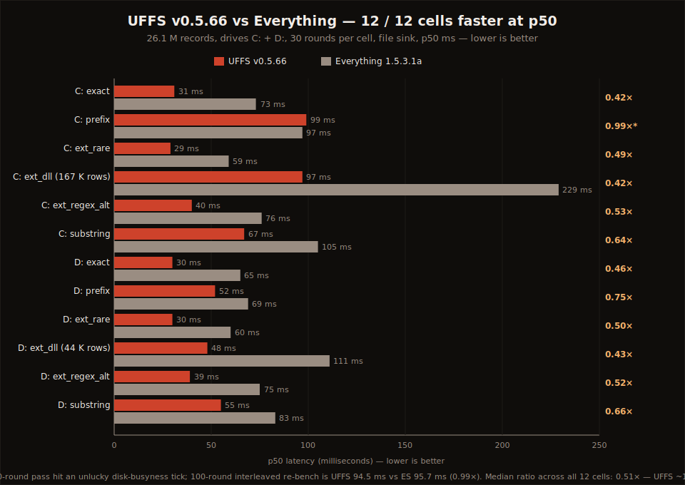
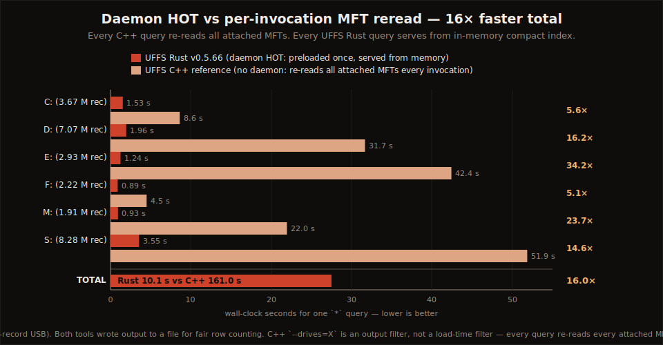
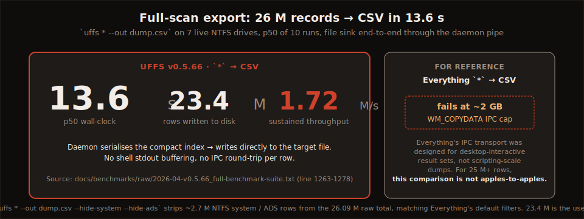

# UFFS Benchmarks

**Benchmark-driven NTFS search.** Every number on this page is backed by a raw log, a reproducible script, and a dated frozen report. Nothing here is evergreen — every claim has a version and a date attached to it.

---

## Current canonical report

**[2026-04 · v0.5.66 vs Everything and the UFFS C++ reference →](2026-04-v0.5.66-vs-everything-and-cpp.md)**









Four numbers the report establishes, against 26 million live NTFS records on a Ryzen 9 3900XT:

1. **12 / 12 head-to-head cells faster than Everything** at p50 on drives C + D across six pattern classes (exact, prefix, rare-ext, common-ext, regex-alternation, substring). Median ratio **0.51× — UFFS is ~1.96× faster**.
2. **UFFS cold-build a 26 M-record index faster than C++ reads the same MFTs with a warm page cache.** 177.4 s vs 457.2 s — **2.6× faster**, while building a persistent compact index + trigram + extension indexes + daemon.
3. **0–3 ms daemon-side latency for targeted queries** at 26 M records (29–32 ms CLI end-to-end including Windows process-creation cold-spawn).
4. **16.0× faster than C++ in the honest workflow comparison.** Seven back-to-back `*` queries on different drives: UFFS serves from the daemon in 10.1 s total; C++ pays full MFT re-read cost every invocation and takes 161.0 s.

The report publishes **everything these numbers don't cover too** — a row-count caveat for pathological patterns, two known regressions UFFS is currently slower on than its own v0.5.4 baseline (`*` top-100 and `--sort path`), and what this benchmark explicitly does *not* claim.

---

## How UFFS benchmarks

**Ready to run a benchmark cycle?** See the **[operator runbook →](runbook.md)** for prerequisites,
step-by-step commands, crash recovery, and how to promote results to a canonical report.

Four fairness principles, documented in full in [`methodology.md`](methodology.md) (the single-link
reply to *"this comparison is rigged because..."*):

- **Separate cold / warm / hot.** Cold build + warm restart + hot query are three different workloads. We measure and publish them separately instead of averaging them into one "startup time" lie.
- **Separate interactive from bulk.** Targeted-query latency (`notepad.exe`, `*.dll`) and full-scan export (`*` → CSV for 23 M rows) are different workload classes. Different tools win each. We test both.
- **Publish the failures.** Two v0.5.66 workloads are currently slower than the v0.5.4 baseline. Both are named, measured, rooted-cause, and tracked in the canonical report's §Known regressions.
- **Publish the raw data.** Every table above and in the canonical report cites the exact log file and line range. The **curated, verbatim raw captures** live in [`raw/`](raw/) (git-tracked, never edited after commit); all benchmark scripts under [`scripts/windows/`](../../scripts/windows/). Click any citation in the canonical report to land on the actual PowerShell log line that produced the number.

---

## Reproduce

Elevated PowerShell, repository root, after `cargo build --release`:

```powershell
# Cross-tool comparison (UFFS Rust vs UFFS C++ vs Everything, 30 rounds per cell)
rust-script .\scripts\windows\cross-tool-benchmark.rs `
    --rounds 30 --tools uffs_rust,uffs_cpp,es --sinks file

# Per-drive Rust vs C++ parity (cold + daemon-HOT, matches §Head-to-head 2 in the canonical report)
.\scripts\windows\cold-parity-per-drive.ps1 `
    -Drives C,D,E,F,M,S -PurgeCacheFirst `
    -OutputFile LOG\my_parity_run.txt
```

Both scripts emit pre-formatted markdown tables at the end that drop straight into a benchmark report file. See [`scripts/windows/cold-parity-per-drive.ps1`](../../scripts/windows/cold-parity-per-drive.ps1) for CLI options.

---

## Archive

Frozen snapshots of prior canonical reports, never retroactively edited. See [`archive/README.md`](archive/README.md) for the archive policy.

*Currently empty — the v0.5.66 report above is the first canonical snapshot. Future reports supersede it; this one gets moved to `archive/2026-04-v0.5.66-vs-everything-and-cpp.md` verbatim.*

---

## What's not in here

- **No "fastest on Windows" superlative.** Different workloads have different winners. UFFS is measurably faster than Everything and the C++ reference on the documented patterns — that's what we claim.
- **No WizFile numbers yet** — WizFile has no automated-comparison flag (`--out` equivalent). When we add harness support, results land here.
- **No "bring your own drives" comparison** — all numbers come from the same test machine. Per-user results will vary with CPU, drive topology, and drive fullness.

For the full positioning story (competitor landscape, claim framework, what to amplify vs qualify), see the internal strategy docs: [`docs/dev/architecture/ntfs_mcp_marketing_strategy_deep_dive.md`](../dev/architecture/ntfs_mcp_marketing_strategy_deep_dive.md) and [`docs/dev/architecture/marketing_strategy_adjustment_after_benchmark_update.md`](../dev/architecture/marketing_strategy_adjustment_after_benchmark_update.md).
