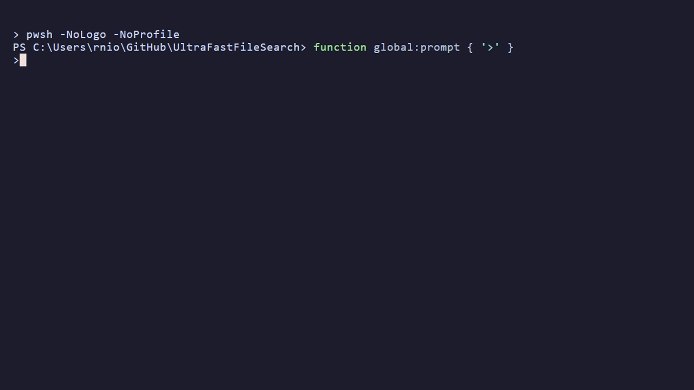

# CLI Overview

`uffs` is the command-line interface for Ultra Fast File Search.  It reads
NTFS Master File Tables directly and searches millions of files in
milliseconds.

**Search is the default action** — just type `uffs <pattern>`.  No
command required; management lives under `--<command>` (§6).



> *Real commands, real result counts, real measured latency on a hot daemon. Recorded against the real CLI (see the [demo kit](../../scripts/dev/demo/README.md)).*

> **See also:**
> [Getting Started](getting-started.md) ·
> [Search Modes](search-modes.md) ·
> [Filters](filters.md) ·
> [Sorting](sorting.md) ·
> [Output Formats](output-formats.md)

---

## 1  Search (Default Action)

When the first token is not a `--command`, `uffs` performs a search.  The
first positional argument is the pattern.

```
uffs <PATTERN> [OPTIONS]
```

### Pattern Syntax

| Syntax | Mode | Detail |
|--------|------|--------|
| `*.ext` | Glob | Wildcards `*`, `?`, `[…]` → [Search Modes §2](search-modes.md#2--glob-patterns-default) |
| `word` | Literal | Substring match on full path → [Search Modes §3](search-modes.md#3--literal-search) |
| `>regex` | Regex | `>` prefix activates regex → [Search Modes §4](search-modes.md#4--regex-search) |
| `c:/path*` | Path-aware | Contains separators → [Search Modes §5](search-modes.md#5--path-aware-patterns) |

### Scope Prefixes (Everything-compatible)

| Prefix | Effect | Detail |
|--------|--------|--------|
| `path:` | Match against the **full path**, not just filename | [Search Modes §10](search-modes.md#10--scope-prefixes) |
| `dir:` | Only search **directories** | Same as `--dirs-only` |
| `file:` | Only search **files** | Same as `--files-only` |

### Pattern Sugar

| Flag | Effect | Detail |
|------|--------|--------|
| `--begins-with <PREFIX>` | Sugar for `PREFIX*` | [Search Modes §11](search-modes.md#11--pattern-sugar-flags) |
| `--ends-with <SUFFIX>` | Sugar for `*SUFFIX` | Same |
| `--contains <NEEDLE>` | Sugar for `*NEEDLE*` | Same |
| `--not-contains <NEEDLE>` | Exclude names containing NEEDLE | Maps to `--exclude` |

### Search Modifiers

| Flag | Effect | Detail |
|------|--------|--------|
| `--case` | Case-sensitive matching | [Search Modes §6](search-modes.md#6--case-sensitivity) |
| `--smart-case` | Auto case-sensitive if pattern has uppercase | [Search Modes §6](search-modes.md#6--case-sensitivity) |
| `--word` | Whole-word boundaries (`\b…\b`) | [Search Modes §7](search-modes.md#7--whole-word-matching---word) |
| `--name-only` | Match filename only, not full path | [Search Modes §8](search-modes.md#8--name-only-matching---name-only) |
| `--in-path <GLOB>` | Filter by directory path (not filename) | [Search Modes §12](search-modes.md#12--path-directory-filter) |

### Drive Selection

| Flag | Example | Effect |
|------|---------|--------|
| `--drive <X>` | `--drive C` | Search single drive |
| `--drives <X,Y>` | `--drives C,D,E` | Search multiple drives concurrently |
| Pattern prefix | `c:/*.dll` | Infer drive from pattern |

### Data Sources

| Flag | Description |
|------|-------------|
| `--mft-file <PATH>` | Use offline raw MFT file(s) instead of live volume |
| `--data-dir <DIR>` | Auto-discover MFT files in `drive_*` subdirectories |
| `--no-cache` | Bypass cache; re-read MFT fresh |

---

## 2  Filters

All filters are detailed in the [Filters guide](filters.md).  Summary:

| Flag | Category | Quick Description |
|------|----------|-------------------|
| `--files-only` | Scope | Files only |
| `--dirs-only` | Scope | Directories only |
| `--hide-system` | Scope | Hide `$`-prefixed NTFS metadata files |
| `--hide-ads` | Scope | Hide Alternate Data Stream entries |
| `--min-size <SIZE>` | Size | Minimum logical size (e.g. `100MB`, `1GB`) |
| `--max-size <SIZE>` | Size | Maximum logical size |
| `--exact-size <SIZE>` | Size | Exactly this size (shorthand for min=max) |
| `--min-size-on-disk <SIZE>` | Size | Minimum allocated size ([concept](concepts.md#1--size-vs-size-on-disk)) |
| `--max-size-on-disk <SIZE>` | Size | Maximum allocated size |
| `--exact-size-on-disk <SIZE>` | Size | Exactly this allocated size |
| `--newer <SPEC>` | Date | Modified within / after |
| `--older <SPEC>` | Date | Modified before |
| `--newer-created <SPEC>` | Date | Created within / after |
| `--older-created <SPEC>` | Date | Created before |
| `--newer-accessed <SPEC>` | Date | Accessed within / after |
| `--older-accessed <SPEC>` | Date | Accessed before |
| `--between <START,END>` | Date | Time range shorthand (e.g. `2026-01-01,2026-03-31`) |
| `--month <SPEC>` | Date | Month-of-year filter (jan, Q1, etc.) |
| `--attr <LIST>` | Attribute | Require/exclude NTFS attributes |
| `--type <CATEGORY>` | Type | Semantic type: code, picture, video, … |
| `--ext <LIST>` | Extension | Filter by extension or collection |
| `--min-descendants <N>` | Tree | Min child count (dirs) |
| `--max-descendants <N>` | Tree | Max child count (dirs) |
| `--exact-descendants <N>` | Tree | Exactly N children |
| `--min-treesize <SIZE>` | Tree | Min subtree logical size ([concept](concepts.md#2--tree-size--tree-allocated)) |
| `--max-treesize <SIZE>` | Tree | Max subtree logical size |
| `--min-tree-allocated <SIZE>` | Tree | Min subtree allocated size |
| `--max-tree-allocated <SIZE>` | Tree | Max subtree allocated size |
| `--min-bulkiness <N>` | Derived | Min waste ratio ([concept](concepts.md#3--bulkiness-waste-ratio)) |
| `--max-bulkiness <N>` | Derived | Max waste ratio |
| `--min-name-length <N>` | Derived | Min filename character count |
| `--max-name-length <N>` | Derived | Max filename character count |
| `--min-path-length <N>` | Derived | Min full-path character count |
| `--max-path-length <N>` | Derived | Max full-path character count |
| `--in-path <GLOB>` | Path | Directory path must match glob |
| `--exclude <GLOB>` | Exclude | Exclude matching filenames |
| `-n, --limit <N>` | Limit | Max results (0 = unlimited) |

---

## 3  Sorting

All 36+ sortable columns are detailed in the [Sorting guide](sorting.md).
Summary:

| Flag | Example | Effect |
|------|---------|--------|
| `--sort <SPEC>` | `--sort size` | Sort by column (smart default direction) |
| `--sort <SPEC>` | `--sort size:asc,name` | Multi-tier with explicit direction |
| `--sort-desc` | | Flip primary sort direction |

**Popular sort columns:** `size`, `modified`, `created`, `name`, `ext`,
`path`, `treesize`, `bulkiness`, `pathlength`, `namelength`,
`descendants`, `type`, `hidden`, `compressed`, `directory_flag`.
See [Sorting §2](sorting.md) for the full list.

---

## 4  Output Control

All output options are detailed in the [Output Formats guide](output-formats.md).
Summary:

| Flag | Default | Description |
|------|---------|-------------|
| `--format <FMT>` | `csv` | Output format: `csv`, `json`, `table`, `custom` |
| `--columns <LIST>` | `all` | Columns to output (comma-separated or `all`) |
| `--out <DEST>` | `console` | Output destination: `console` or a filename |
| `--sep <CHAR>` | `,` | Column separator (CSV mode) |
| `--quotes <CHAR>` | `"` | Quote character for string fields |
| `--header <BOOL>` | `true` | Include header row (`--header false` to suppress) |
| `--pos <STR>` | `1` | Representation for true/active boolean attributes |
| `--neg <STR>` | `0` | Representation for false/inactive boolean attributes |

---

## 5  Inline Aggregation Flags

These flags run server-side analytics alongside (or instead of) search
results.  For the `uffs --agg` command, see §6 below.

> `--stats` and `--agg` are dual-use: as the **first token**
> (`uffs --stats`, `uffs --agg <preset>`) they are commands; **after a
> pattern** (`uffs '*.log' --stats size`) they are inline modifiers on a
> search.  The first token decides — see [CLI Grammar](../architecture/cli-grammar.md).

| Flag | Effect |
|------|--------|
| `--count` | Show total matching count (suppresses rows) |
| `--facet <FIELD[:TOP]>` | Top-N breakdown by field (e.g. `--facet extension`) |
| `--stats <FIELD>` | Scalar statistics for a numeric field |
| `--histogram <FIELD[:INTERVAL]>` | Histogram buckets |
| `--agg <SPEC>` | Raw aggregation spec (power syntax) |
| `--rows` | Include matching rows alongside aggregates |
| `--agg-cursor <CURSOR>` | Continue from a previous page |
| `--agg-page-size <N>` | Max buckets per page |

> **Full aggregation guide:** [Aggregation](aggregation.md)

---

## 6  Commands

> Building/loading an index is **daemon-managed** — there is no standalone
> `uffs index` command. Point the daemon at a live drive or a raw MFT with
> `uffs --daemon start --data-dir <dir>` / `--mft-file <file>` (see
> [Daemon](daemon.md)). For low-level NTFS volume/record inspection, use the
> separate `uffs-mft` tool (`uffs-mft --help`).

### `uffs --stats`

Show file statistics.  Without a path, connects to the daemon and
runs the `overview` aggregate preset.  With a path, loads a parquet
index file.

```bash
uffs --stats                    # Daemon mode (live overview)
uffs --stats index.parquet      # Parquet mode (--top 20 for largest files)
```

### `uffs --agg` (alias: `uffs --aggregate`)

Run server-side analytics on the filesystem index.  Returns aggregate
results only — no file rows.

```bash
uffs --agg overview         # Full filesystem overview
uffs --agg by_extension     # Top 50 extensions
uffs --agg by_type          # Breakdown by file type
uffs --agg by_drive         # Per-drive totals
uffs --agg by_size          # Size distribution
uffs --agg by_age           # Age distribution
uffs --agg count            # Simple total count
```

> **Full guide:** [Aggregation](aggregation.md)

### `uffs --daemon`

Manage the UFFS background daemon.  The daemon starts automatically on
first search — these commands give explicit control.

```bash
uffs --daemon start --data-dir ~/uffs_data   # Start with specific data
uffs --daemon status                          # Check status
uffs --daemon stats                           # Performance statistics
uffs --daemon stop                            # Graceful shutdown
uffs --daemon kill                            # Force kill + cleanup
uffs --daemon restart                         # Stop then restart
```

> **Full guide:** [Daemon](daemon.md)

### `uffs --mcp`

Manage the MCP server for AI agent integration.

```bash
uffs --mcp run                      # Run on stdin/stdout (for AI hosts)
uffs --mcp start                    # Start HTTP server on :8080 (background)
uffs --mcp start --port 9090        # Custom port
uffs --mcp status                   # Health + stats
uffs --mcp stop                     # Graceful shutdown
uffs --mcp reload                   # Reload all MCP sessions after binary update
```

> **Full guide:** [MCP Server](mcp.md)

### `uffs --status`

Show combined system status — daemon + MCP HTTP server health in one
view.

```bash
uffs --status
```

---

## 7  Advanced / Diagnostic Flags

These flags are for power users, profiling, and parity testing:

| Flag | Description |
|------|-------------|
| `-v, --verbose` | Enable verbose output (global) |
| `--profile` | Show detailed timing breakdown |
| `--benchmark` | Skip output; measure only MFT reading + filtering |
| `--no-bitmap` | Disable MFT bitmap optimisation (read ALL records) |
| `--no-cache` | Bypass cache; re-read MFT fresh |
| `--query-mode <MODE>` | Force query path: `auto`, `index`, `dataframe` |
| `--tz-offset <HOURS>` | Override timezone offset for timestamps |
| `--parity-compat` | C++ parity-compatible output (25 baseline columns) |

> **Full diagnostics guide:** [Advanced Diagnostics](advanced-diagnostics.md)

---

## 8  Examples

For a comprehensive recipe gallery organized by workflow (quick find,
cleanup, developer/admin, attribute search, output piping), see
**[Getting Started §5 — Recipes](getting-started.md#5--recipes)**.

Quick taste:

```bash
uffs '*.pdf' --newer 7d --sort size --limit 20
uffs '*' --dirs-only --max-descendants 0
uffs '>.*\.log$' --newer 24h
```
